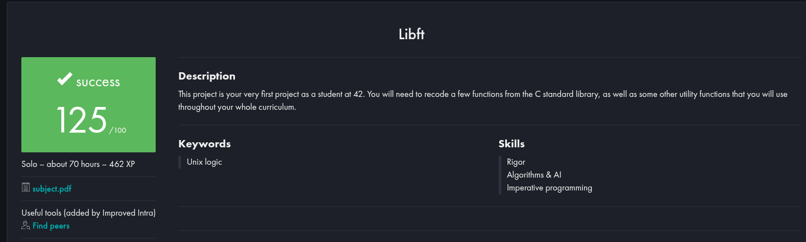

# ft_libft

Reimplementação de diversas funções da biblioteca padrão C, como parte do currículo da 42 São Paulo.

 <!-- Aqui você coloca o screenshot da sua nota ou avaliação da libft -->

## 📌 Objetivo

Recriar, do zero, parte da biblioteca padrão do C, além de implementar funções adicionais úteis para manipulação de strings, memória e listas encadeadas.  
Este projeto desenvolve habilidades essenciais como:
- Lógica de programação
- Alocação de memória
- Manipulação de ponteiros e arrays
- Modularização de código
- Implementação de listas encadeadas

## Nota
Há mais funções que o necessário (como por exemplo a gnl, ft_printf), pois essa libft foi atualizada conforme o tempo.

## ✅ Funções implementadas

> ⚠️ Aqui você lista **apenas as funções que você implementou** na sua libft. Exemplo:

### Parte 1 — Libc Functions

- `ft_isalpha`
- `ft_isdigit`
- `ft_isalnum`
- `ft_isascii`
- `ft_isprint`
- `ft_strlen`
- `ft_memset`
- `ft_bzero`
- `ft_memcpy`
- `ft_memmove`
- `ft_strlcpy`
- `ft_strlcat`
- `ft_toupper`
- `ft_tolower`
- `ft_strchr`
- `ft_strrchr`
- `ft_strncmp`
- `ft_memchr`
- `ft_memcmp`
- `ft_strnstr`
- `ft_atoi`
- `ft_calloc`
- `ft_strdup`

### Parte 2 — Funções adicionais

- `ft_substr`
- `ft_strjoin`
- `ft_strtrim`
- `ft_split`
- `ft_itoa`
- `ft_strmapi`
- `ft_striteri`
- `ft_putchar_fd`
- `ft_putstr_fd`
- `ft_putendl_fd`
- `ft_putnbr_fd`

### Parte Bônus — Listas encadeadas

- `ft_lstnew`
- `ft_lstadd_front`
- `ft_lstsize`
- `ft_lstlast`
- `ft_lstadd_back`
- `ft_lstdelone`
- `ft_lstclear`
- `ft_lstiter`
- `ft_lstmap`

## 🛠️ Compilação

#### ***Clone este repositório e compile com:***

```bash
git clone https://github.com/Bruno-nog/42_projects.git 42_projects
cd 42_projects
cd libft
make
```

# ft_libft

Reimplementation of various functions from the C standard library, as part of the 42 São Paulo curriculum.

 <!-- Here you put the screenshot of your libft grade -->

## 📌 Objective

Recreate from scratch part of the C standard library, as well as implement additional utility functions for string handling, memory management, and linked lists.  
This project develops essential skills such as:  
- Programming logic  
- Memory allocation  
- Pointer and array manipulation  
- Code modularization  
- Linked list implementation  

## Note
There are more functions than required (for example get_next_line, ft_printf), since this libft has been updated over time.

## ✅ Implemented Functions

> ⚠️ Here you list **only the functions you implemented** in your libft. Example:

### Part 1 — Libc Functions

- `ft_isalpha`  
- `ft_isdigit`  
- `ft_isalnum`  
- `ft_isascii`  
- `ft_isprint`  
- `ft_strlen`  
- `ft_memset`  
- `ft_bzero`  
- `ft_memcpy`  
- `ft_memmove`  
- `ft_strlcpy`  
- `ft_strlcat`  
- `ft_toupper`  
- `ft_tolower`  
- `ft_strchr`  
- `ft_strrchr`  
- `ft_strncmp`  
- `ft_memchr`  
- `ft_memcmp`  
- `ft_strnstr`  
- `ft_atoi`  
- `ft_calloc`  
- `ft_strdup`  

### Part 2 — Additional Functions

- `ft_substr`  
- `ft_strjoin`  
- `ft_strtrim`  
- `ft_split`  
- `ft_itoa`  
- `ft_strmapi`  
- `ft_striteri`  
- `ft_putchar_fd`  
- `ft_putstr_fd`  
- `ft_putendl_fd`  
- `ft_putnbr_fd`  

### Bonus Part — Linked Lists

- `ft_lstnew`  
- `ft_lstadd_front`  
- `ft_lstsize`  
- `ft_lstlast`  
- `ft_lstadd_back`  
- `ft_lstdelone`  
- `ft_lstclear`  
- `ft_lstiter`  
- `ft_lstmap`  

## 🛠️ Compilation

#### ***Clone this repository and compile with:***

```bash
git clone https://github.com/Bruno-nog/42_projects.git 42_projects
cd 42_projects
cd libft
make
