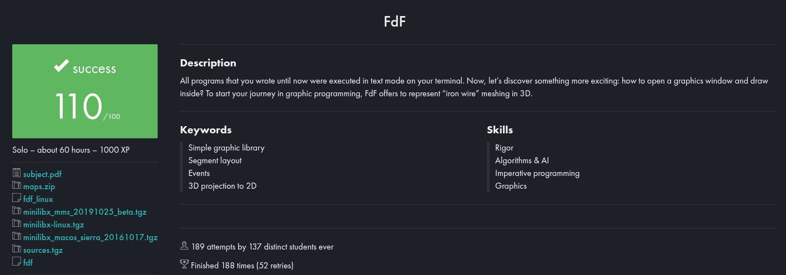
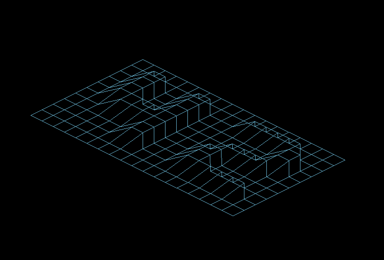
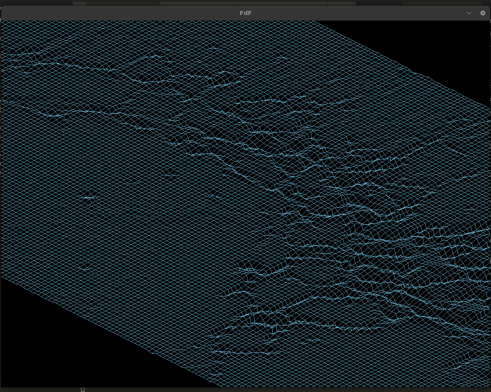
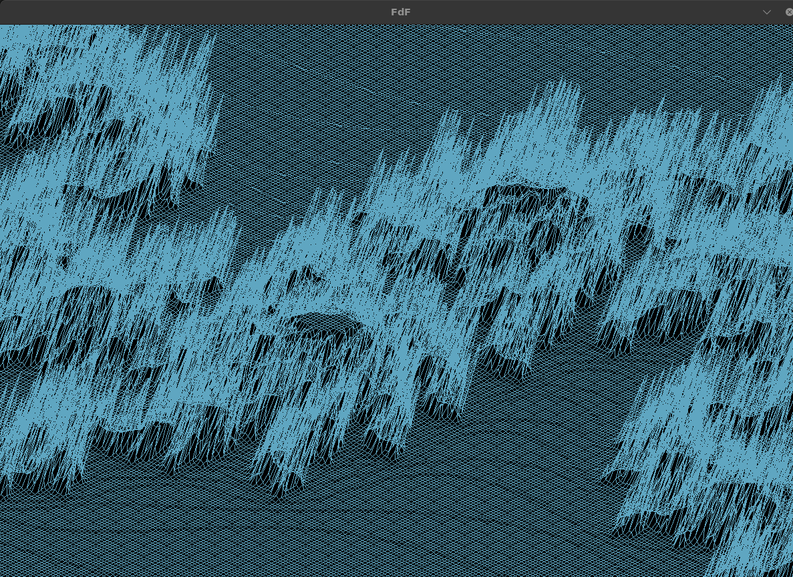

# FdF

Renderizador de mapas 3D em wireframe, desenvolvido em C com MiniLibX, como parte do currículo da 42 São Paulo.



## Visão Geral

O FdF carrega um arquivo de mapa de elevações (.fdf), projeta cada ponto em perspectiva isométrica e exibe uma representação em malha de linhas. O projeto enfatiza:

- Transformações 3D: isométrica por defeito, com zoom e pan dinâmicos.

- Interatividade: controles de teclado para ajustar zoom, deslocamento e rotações nos eixos X, Y e Z.

- Cores Baseadas em Altitude: gradientes personalizáveis de acordo com a altura dos pontos.

- Performance: desenho com buffer duplo para evitar flicker e atualizações regionais para otimizar FPS.

## Recursos Bônus (altamente recomendado)

- Rotações 3D (X, Y, Z): matrices de rotação aplicadas antes da projeção.

- Gradientes de Cor: definição de cores mínimas e máximas para altitude.

- HUD Simples: indicadores de controles na tela.

- Zoom Suave: animação progressiva ao ajustar o nível de zoom.

## Tecnologias

- Linguagem C (padrão C99)

- MiniLibX para janela e eventos

- Algoritmos de projeção e Bresenham para linha

## Imagens de alguns mapas

### 42.fdf


### mars.fdf


### julia.fdf


### 🧠 Conceitos Aprendidos

Com o FdF, você irá aplicar e consolidar conceitos como:

- Transformações Lineares: matrizes de rotação e escala para manipulações 3D.

- Projeção Isométrica: conversão de coordenadas 3D para visualização 2D.

- Algoritmo de Bresenham: desenho eficiente de linhas entre vértices.

- Gerenciamento de Buffers: uso de buffer duplo para renderização suave.

- Interação em Tempo Real: captura e tratamento de eventos de teclado com MiniLibX.

- Mapeamento de Cores: aplicação de gradientes baseados em altura.

- Otimização de Performance: atualizações regionais e cálculos pré-processados.

## Como Executar

Basta compilar com o Makefile e executar:
```bash
make && ./fdf maps/map.fdf
```

# English:

# FdF

Wireframe 3D map renderer, developed in C with MiniLibX, as part of the 42 São Paulo curriculum.


## Overview

FdF loads an elevation map file (.fdf), projects each point in an isometric perspective, and displays a line mesh representation. The project emphasizes:

- 3D Transformations: isometric by default, with dynamic zoom and pan.

- Interactivity: keyboard controls to adjust zoom, offset, and rotations around the X, Y, and Z axes.

- Altitude-Based Colors: customizable gradients according to point elevation.

- Performance: double buffering to prevent flicker and regional updates to optimize FPS.

## Bonus Features (highly recommended)

- 3D Rotations (X, Y, Z): rotation matrices applied before projection.

- Color Gradients: define minimum and maximum colors based on altitude.

- Simple HUD: on-screen control indicators.

- Smooth Zoom: progressive animation when adjusting zoom level.

## Technologies

- C language (C99 standard)

- MiniLibX for windowing and event handling

- Projection and Bresenham line algorithms


## Some images of maps

### 42.fdf


### mars.fdf


### julia.fdf


## 🧠 Concepts Learned

With FdF, you will apply and consolidate concepts such as:

- Linear Transformations: rotation and scaling matrices for 3D manipulations.

- Isometric Projection: converting 3D coordinates for 2D display.

- Bresenham’s Algorithm: efficient line drawing between vertices.

- Buffer Management: using double buffering for smooth rendering.

- Real-Time Interaction: capturing and handling keyboard events with MiniLibX.

- Color Mapping: applying elevation-based gradients.

- Performance Optimization: regional updates and precomputed calculations.

## How to Run

Simply compile with the Makefile and run:
```bash
make && ./fdf maps/map.fdf
```