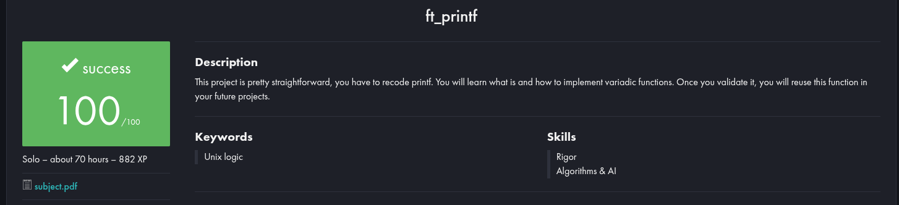

# ft_printf

Reimplementação da função `printf` da biblioteca padrão C, como parte do currículo da 42 São Paulo.



## 📌 Objetivo

Recriar a função `printf` com suporte a múltiplos formatos de saída, sem utilizar a biblioteca padrão (`printf`, `sprintf`, `snprintf` etc). O projeto visa consolidar o entendimento de:
- Manipulação de strings
- Ponteiros e variádicos (`stdarg.h`)
- Escrita formatada e modularização de código
- Alocação de memória e buffers

## ✅ Especificações

A função aceita os seguintes formatos:

| Conversão | Descrição                |
|-----------|--------------------------|
| `%c`      | Caractere                |
| `%s`      | String                   |
| `%p`      | Ponteiro (endereço)      |
| `%d` / `%i` | Inteiro decimal        |
| `%u`      | Inteiro decimal sem sinal |
| `%x` / `%X` | Hexadecimal (min/maiúsculo) |
| `%%`      | Imprime o caractere `%`  |


## 🛠️ Compilação

#### ***Clone este repositório, compile e execute com:

```bash
git clone https://github.com/Bruno-nog/42_projects.git 42_projects
cd 42_projects
cd ft_printf
```
(Descomente a main)
```bash
cc -w ft_printf.c ft_printf_utils.c
./a.out
```
#### ***Então você verá testes comparando o comportamento do printf original com o do projeto ft_printf. 
```bash
Test1
string  A  -42  -42
ft_printf count = 20

string  A  -42  -42
printf count = 20


Test2

p: 0x40303b

ft_printf count = 13

p: 0x40303b

printf count = 13


Test3
unsigned: 42
ft_printf count = 13

unsigned: 42
printf count = 13


Test4
unsigned: 4294967254
ft_printf count = 21

unsigned: 4294967254
printf count = 21


Test5
hex: ffffffd6
ft_printf count = 14

hex: ffffffd6
printf count = 14


Test6
hex: FFFFFFD6
ft_printf count = 14

hex: FFFFFFD6
printf count = 14


Test7
percentage %
ft_printf count = 13

percentage %
printf count = 13


Test8
f%k
ft_printf count = 4

f%k
printf count = 4

...
```

<br>

# English:

# ft_printf

Reimplementation of the standard C library’s `printf` function, as part of the 42 São Paulo curriculum.

## 📌 Objective

Recreate the `printf` function with support for multiple output formats, without using the standard library (`printf`, `sprintf`, `snprintf`, etc.). This project aims to solidify understanding of:
- String manipulation
- Pointers and variadic functions (`stdarg.h`)
- Formatted output and code modularization
- Memory allocation and buffering

## ✅ Specifications

The function supports the following specifiers:

| Conversion | Description                    |
|------------|--------------------------------|
| `%c`       | Character                      |
| `%s`       | String                         |
| `%p`       | Pointer (address)              |
| `%d` / `%i`| Signed decimal integer        |
| `%u`       | Unsigned decimal integer       |
| `%x` / `%X`| Hexadecimal (lower/uppercase) |
| `%%`       | Prints the `%` character       |

## 🛠️ Compilation

#### ***Clone this repository, compile and run with:***

```bash
git clone https://github.com/Bruno-nog/42_projects.git 42_projects
cd 42_projects
cd ft_printf
```
(Uncomment the main)
```bash
cc -w ft_printf.c ft_printf_utils.c
./a.out
```

```bash
Test1
string  A  -42  -42
ft_printf count = 20

string  A  -42  -42
printf count = 20


Test2

p: 0x40303b

ft_printf count = 13

p: 0x40303b

printf count = 13


Test3
unsigned: 42
ft_printf count = 13

unsigned: 42
printf count = 13


Test4
unsigned: 4294967254
ft_printf count = 21

unsigned: 4294967254
printf count = 21


Test5
hex: ffffffd6
ft_printf count = 14

hex: ffffffd6
printf count = 14


Test6
hex: FFFFFFD6
ft_printf count = 14

hex: FFFFFFD6
printf count = 14


Test7
percentage %
ft_printf count = 13

percentage %
printf count = 13


Test8
f%k
ft_printf count = 4

f%k
printf count = 4

...
```