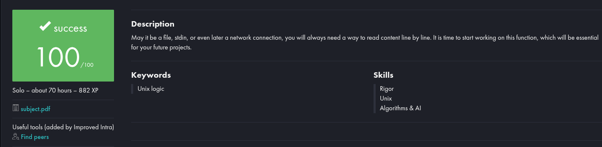

# get_next_line

Implementação da função `get_next_line`, responsável por ler e retornar uma linha de um descritor de arquivo por chamada, como parte do currículo da 42 São Paulo.



## 📌 Objetivo

Criar uma função que leia de um `file descriptor` e retorne **uma linha por vez**, de forma segura e com gestão correta de memória, buffers e múltiplos descritores simultâneos.  
Este projeto aprofunda conhecimentos em:
- Leitura de arquivos com `read`
- Manipulação de buffers
- Gerenciamento de listas encadeadas
- Controle de memória dinâmica
- Design de algoritmos iterativos com persistência entre chamadas

## ✅ Especificações

A função principal segue esta assinatura:

```c
char *get_next_line(int fd);
```
# Regras e comportamentos:

- Lê e retorna uma linha completa (incluindo o \n, se presente).

- Deve funcionar com diferentes descritores ao mesmo tempo.

- A leitura é feita em blocos de tamanho BUFFER_SIZE, definido pelo usuário.

- Deve retornar NULL ao fim do arquivo ou em caso de erro.

## Arquivos principais:

- get_next_line.c – lógica principal da leitura

- get_next_line_utils.c – funções auxiliares (busca de \n, tamanho de linha, etc.)

- get_next_line.h – protótipos e definição da struct de lista

- Internamente, a função utiliza uma lista encadeada (t_gnl_list) para armazenar os buffers lidos até formar uma linha completa.

### 🛠️ Compilação
Clone este repositório, compile e execute com:
```bash
git clone https://github.com/Bruno-nog/42_projects.git 42_projects
cd 42_projects
cd get_next_line
```
(Descomente a main de testes no final do get_next_line.c)

```bash
cc -Wall -Wextra -Werror get_next_line.c get_next_line_utils.c
./a.out
```

## Execução

- crie um arquivo do mesmo nome que está na main;
- coloque algo dentro do arquivo (de preferência separado por linhas);
- execute o a.out;
<br>

# English:

# get_next_line

Implementation of the `get_next_line` function, responsible for reading and returning one line from a file descriptor per call, as part of the 42 São Paulo curriculum.


## 📌 Objective

Create a function that reads from a file descriptor and returns **one line at a time**, with proper memory, buffer, and multi-descriptor management.  
This project deepens knowledge in:  
- File reading with `read`  
- Buffer handling  
- Linked list management  
- Dynamic memory control  
- Designing iterative algorithms with persistence across calls  

## ✅ Specifications

The main function has the following signature:

```c
char *get_next_line(int fd);
```

# Rules and Behavior

- Reads and returns a complete line (including the \n, if present).

- Must work with multiple file descriptors simultaneously.

- Reads in blocks of size BUFFER_SIZE, defined by the user.

- Returns NULL at end-of-file or on error.

## Main Files

- get_next_line.c – main reading logic

- get_next_line_utils.c – helper functions (finding \n, calculating line length, etc.)

- get_next_line.h – prototypes and definition of the linked list struct

- Internally, the function uses a linked list (t_gnl_list) to store the - buffers read until a full line is assembled.

### 🛠️ Compilation
Clone this repository, compile, and run with:
```bash
git clone https://github.com/Bruno-nog/42_projects.git 42_projects
cd 42_projects
cd get_next_line
```
(Uncomment the test main at the end of get_next_line.c)

```bash
cc -Wall -Wextra -Werror get_next_line.c get_next_line_utils.c
./a.out
```

## Execution
- create a file with the same name as in main;

- put some content inside the file (preferably separated by lines);

- run the a.out executable;