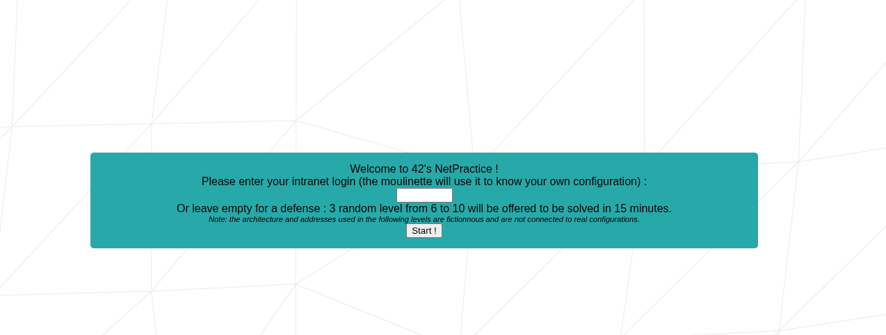
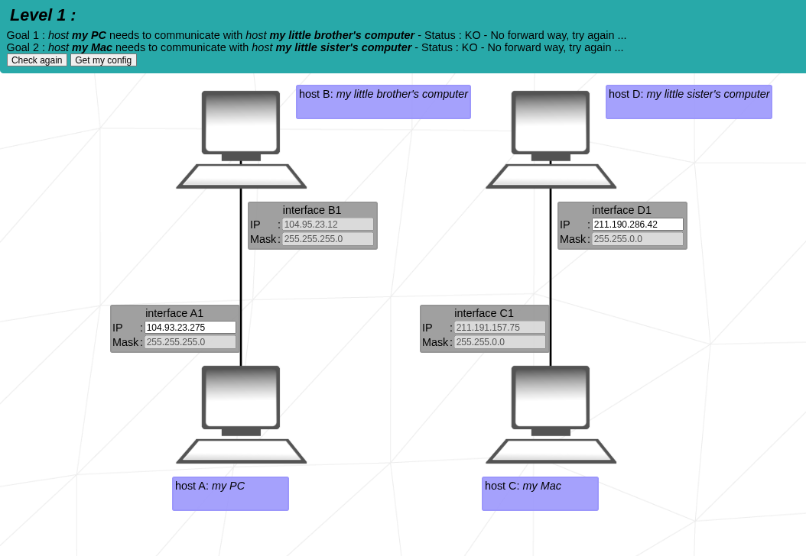

# Net Practice

Conjunto de exercícios e pequenos exemplos para treinar conceitos de redes e programação de sockets (TCP/UDP).  
Objetivo: ser um repositório prático para testar servidores/clients simples, depurar conexões e experimentar ferramentas de rede.

---

## O que tem aqui
- Exemplos didáticos de **servidores** e **clientes** (TCP/UDP).
- Scripts e testes simples (quando aplicável).

---

## Como usar (resumo rápido)
1. Entre na pasta `/net_practice`
2. Abra o arquivo `index.html` com o chrome ou qualquer outro navegador
3. Então, clique em start, assim irá iniciar o exercício 1 até o 10

> ***Caso você queira que seja 3 exercícios aleatórios, coloque um nome e então clique em start.***

---

## Conceitos abordados (preencha conforme o conteúdo)

- **Modelo OSI / TCP-IP** — camadas e responsabilidades.

- **Endereçamento IP (IPv4 e noções de IPv6)** — estrutura, representação.

- **Máscara / Subnetting (CIDR)** — calcular rede, broadcast e hosts.

- **Roteamento básico & tabela de rotas** — rota padrão, next-hop.

- **NAT (masquerading / port forwarding)** — tradução de endereços e exposição de serviços.

- **ARP** — resolução IP ⇄ MAC.

- **Switching e VLANs** — segmentação por domínio de broadcast.

- **TCP vs UDP (portas e sockets)** — confiabilidade, handshake, portas comuns.

- **DNS e DHCP** — resolução de nomes e alocação dinâmica de IP.

- **Ferramentas essenciais (ping, traceroute, tcpdump/wireshark, netcat, ip/ifconfig)** — diagnóstico e captura.

- **Firewalls (iptables/nftables)** — regras de filtragem e bloqueio de tráfego.

- **VPN e segurança de tráfego** — tunelamento, cifragem e boas práticas.

---

# Imagem de um exercício

----

# English: 

# Net Practice

Set of exercises and small examples to practice networking concepts and socket programming (TCP/UDP).  
Goal: to be a practical repository for testing simple servers/clients, debugging connections and experimenting with networking tools.

---

## What’s here
- Didactic examples of **servers** and **clients** (TCP/UDP).
- Simple scripts and tests (when applicable).

---

## How to use (quick summary)
1. Enter the `/net_practice` folder
2. Open the `index.html` file with Chrome or any other browser
3. Then, click start; this will start exercises 1 through 10

> ***If you want it to run 3 random exercises, enter a name and then click start.***

---

## Concepts covered (fill according to content)

- **OSI / TCP-IP Model** — layers and responsibilities.

- **IP Addressing (IPv4 and basics of IPv6)** — structure, representation.

- **Mask / Subnetting (CIDR)** — calculate network, broadcast and hosts.

- **Basic Routing & Routing Table** — default route, next-hop.

- **NAT (masquerading / port forwarding)** — address translation and service exposure.

- **ARP** — IP ⇄ MAC resolution.

- **Switching and VLANs** — segmentation by broadcast domain.

- **TCP vs UDP (ports and sockets)** — reliability, handshake, common ports.

- **DNS and DHCP** — name resolution and dynamic IP allocation.

- **Essential Tools (ping, traceroute, tcpdump/wireshark, netcat, ip/ifconfig)** — diagnosis and capture.

- **Firewalls (iptables/nftables)** — filtering rules and traffic blocking.

- **VPN and Traffic Security** — tunneling, encryption and best practices.

---

# Image of an exercise

