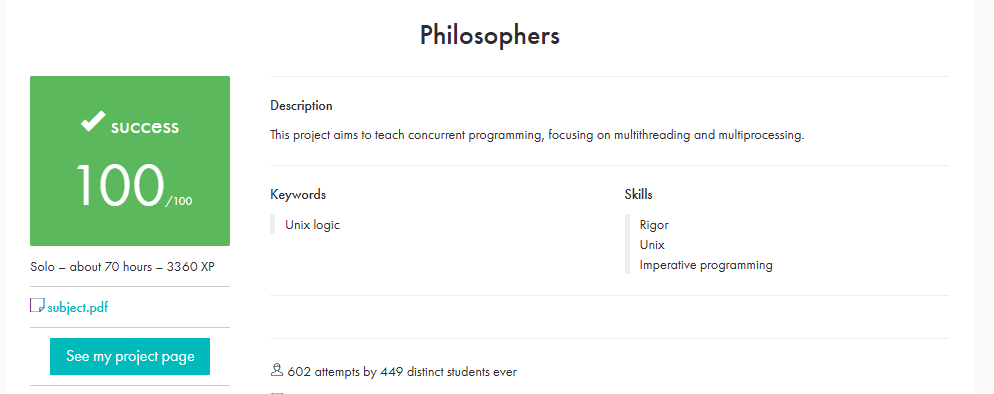
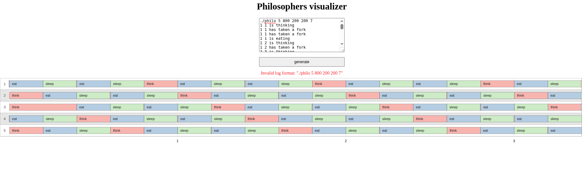

# philosophers

Simulação do problema dos “Dining Philosophers” usando threads e mutexes em C, como parte do currículo da 42 São Paulo.



## 📌 Objetivo

Criar um programa que simule N filósofos sentados em torno de uma mesa circular, onde cada filósofo:

- Pensa

- Pega dois garfos (mutexes)

- Come

- Solta os garfos

- Dorme

O desafio inclui evitar deadlocks, starvation e garantir que nenhum filósofo morra de fome dentro do tempo definido.

## Assinatura de execução:

```bash
./philosophers number_of_philosophers time_to_die time_to_eat time_to_sleep [number_of_times_each_must_eat]
```

### Argumentos:
```bash
number_of_philosophers — número de filósofos e garfos (>= 1)

time_to_die — tempo máximo (ms) sem comer antes de morrer

time_to_eat — duração (ms) para comer

time_to_sleep — duração (ms) para dormir

[number_of_times_each_must_eat] (opcional) — número de refeições que cada filósofo deve fazer antes de encerrar
```
## Regras:

Se um filósofo não comer dentro de time_to_die, ele “morre” e o programa termina exibindo o timestamp e o ID.

Se number_of_times_each_must_eat for fornecido e todos comerem esse número de vezes, o programa encerra normalmente.

Ações (pegar garfo, comer, soltar garfo, dormir, pensar) devem ser ​logadas com timestamp em milissegundos desde o início da simulação.

## 🛠️ Compilação

- Clone e compile com:

- git clone https://github.com/Bruno-nog/42_projects.git 42_projects

- cd 42_projects/philosophers
- make

Isso gera o executável philosophers.

## ▶️ Execução

#### Exemplo com 5 filósofos, morrem após 800ms sem comer, 200ms para comer, 200ms para dormir:

./philo 5 800 200 200

Com limite de 7 refeições por filósofo:

./philo 5 800 200 200 7

## 🖼️ Visualizador

Use o Philosophers Visualizer para observar a simulação graficamente.Abaixo, um exemplo de como ficou a minha simulação:



## 🧼 Observações

A sincronização é feita com mutexes para acesso aos garfos e ao canal de output.

O monitor verifica a condição de morte com polling leve e termina a simulação imediatamente.

Teste com Valgrind para garantir ausência de memory leaks e acessos inválidos.

Se quiser ver logs completos ou testar diferentes cenários, ajuste os parâmetros de entrada e observe o comportamento dos filósofos.

