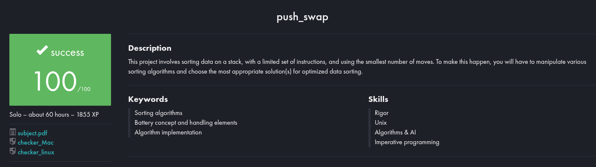

# PUSH_SWAP

Desafio de ordenação onde você deve ordenar uma pilha de inteiros usando apenas operações específicas de pilha e uma pilha auxiliar, implementado em C como parte do currículo da 42 São Paulo.



## 📌 Objetivo

Escrever um programa que receba uma sequência de inteiros únicos e os ordene em ordem crescente com o número mínimo de movimentos, usando duas pilhas (A e B) e apenas estas operações:

- sa / sb / ss — troca os dois primeiros elementos da pilha A, pilha B ou de ambas

- pa / pb — empurra o elemento do topo de uma pilha para a outra

- ra / rb / rr — rotaciona a pilha A, pilha B ou ambas (o primeiro elemento passa a ser o último)

- rra / rrb / rrr — rota rotação reversa da pilha A, pilha B ou ambas (o último elemento passa a ser o primeiro)

Seu objetivo é otimizar para o menor número de operações possível.

## 📂 Fluxo de Trabalho

- Validação de Entrada

- Verificar se os argumentos são inteiros válidos, sem duplicatas e dentro de INT_MIN / INT_MAX.

- Inicialização das Pilhas

- Empurrar todos os argumentos na pilha A na ordem fornecida; a pilha B inicia vazia.

- Estratégia de Ordenação

- Aplicar um algoritmo escolhido que use apenas as operações permitidas para ordenar a pilha A.

## 🚀 Métodos de Ordenação

Existem várias formas de resolver o push_swap, incluindo, mas não se limitando a:

- Turko Logic (usado neste projeto):

- Divide a lista em grupos (chunks), empurra cada chunk para a pilha B e depois retorna para a A na ordem correta.

- Ajusta dinamicamente o tamanho dos chunks com base no total de elementos para balanceamento.

### Inserção Simples:

Empurra todos, exceto 3 elementos, para a pilha B, ordena os 3 na A e depois insere de B para A na posição correta.

#### Radix Sort:

Usa operações bit a bit para empurrar elementos entre pilhas com base na significância dos bits.

#### Inspirado em Quick Sort:

Escolhe pivôs para particionar valores, empurra recursivamente partições para B e retorna para A.

Sinta-se à vontade para explorar e comparar essas abordagens para minimizar sua contagem de movimentos.

## 🛠️ Compilação

Clone o repositório e construa:
```bash
git clone https://github.com/Bruno-nog/42_projects.git 42_projects
cd 42_projects/push_swap
make
```
Isso gera o executável push_swap e (opcional) o checker.

## ▶️ Exemplos de Uso

### Ordenar uma lista pequena

./push_swap 3 2 5 1 4

./push_swap 3 2 5 1 4 | wc -l

### Ordenar 100 números aleatórios (para benchmark)

echo $(shuf -i 1-100 -n 100) | xargs ./push_swap | wc -l

O segundo exemplo exibe o número total de operações usadas.

## 🧼 Dicas & Observações

Teste com o checker (bônus) para verificar se sua sequência de operações produz uma pilha ordenada. (bônus não implementado)

Faça perfilamento com vários tamanhos de entrada para ajustar o tamanho dos chunks ou limiares do algoritmo.

Use Valgrind para garantir que não haja vazamentos de memória.

Experimente diferentes estratégias e compare sua contagem de movimentos para encontrar a solução mais eficiente!

# English: 

# PUSH_SWAP

Sorting challenge where you must sort a stack of integers using only specific stack operations and an auxiliary stack, implemented in C as part of the 42 São Paulo curriculum.


## 📌 Objective

Write a program that takes a sequence of unique integers and sorts them in ascending order with the minimum number of moves, using two stacks (A and B) and only these operations:

- sa / sb / ss — swap the first two elements of stack A, stack B, or both

- pa / pb — push the top element from one stack to the other

- ra / rb / rr — rotate stack A, stack B, or both (first element becomes last)

- rra / rrb / rrr — reverse rotate stack A, stack B, or both (last element becomes first)

Your goal is to optimize for the fewest operations possible.

## 📂 Workflow

- Input Validation

- Ensure arguments are valid integers, no duplicates, and within INT_MIN / INT_MAX.

- Stack Initialization

- Push all arguments into stack A in the given order; stack B starts empty.

- Sorting Strategy

- Apply a chosen algorithm that uses only allowed operations to sort A.

## 🚀 Sorting Methods

There are multiple ways to solve push_swap, including but not limited to:

- Turko Logic (used in this project):

- Divide the list into chunks, push each chunk to stack B, then push back to A in order.

- Dynamically adjust chunk size based on total elements for balance.

### Simple Insertion:

Push all but 3 elements to stack B, sort the 3 in A, then insert from B into A in the correct position.

#### Radix Sort:

Use bitwise operations to push elements between stacks based on bit significance.

#### Quick Sort–Inspired:

Choose pivots to partition values, recursively push partitions to B and back.

Feel free to explore and compare these approaches to minimize your move count.

## 🛠️ Compilation

Clone the repo and build:
```bash
git clone https://github.com/Bruno-nog/42_projects.git 42_projects
cd 42_projects/push_swap
make
```
Generates the executable push_swap and (optional) checker.

## ▶️ Usage Examples

### Sort a small list

./push_swap 3 2 5 1 4 

./push_swap 3 2 5 1 4 | wc -l

### Sort 100 random numbers (for benchmarking)

echo $(shuf -i 1-100 -n 100) | xargs ./push_swap | wc -l

The second example prints the total number of operations used.

## 🧼 Tips & Notes

Test with checker (bonus) to verify your operation sequence produces a sorted stack. (bonus not done)

Profile with multiple input sizes to tune chunk sizes or algorithm thresholds.

Use Valgrind to ensure no memory leaks.

Experiment with different strategies and compare your move counts to find the most efficient solution!